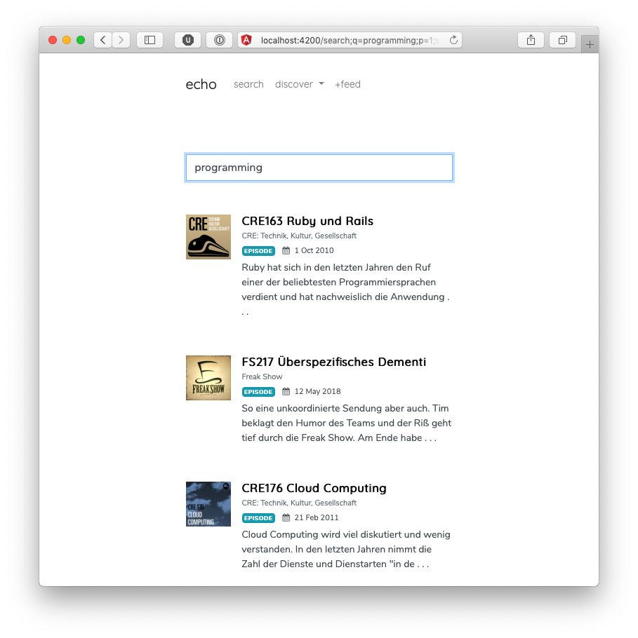

<h1 align="center">
    Concurrent Programming with
     
    Actors and Microservices
</h1>

I am [Maximilian Irro](https://max.irro.at) and this is my master thesis ("Diplomarbeit") I worked on in 2017/2018 as a requirement for the completion of my master curriculum [Software Engineering & Internet Computing](http://www.informatik.tuwien.ac.at/studium/angebot/master/software-engineering-and-internet-computing) at [TU Wien](http://www.informatik.tuwien.ac.at). The supervisor was [Franz Puntigam](http://www.complang.tuwien.ac.at/franz/) from the [Institute for Information Systems Engineering, Compilers and Languages Group](http://www.complang.tuwien.ac.at). This repository contains all materials related to my master thesis project (documents and implementation source codes, measurement data, etc.).

## Table of Contents

* [Abstract](#abstract)
* [Repository Structure](#repository-structure)
* [Thesis Document](#thesis-document)
* [Implementations](#implementations)
    * [Core Library](#core-library)
    * [Actor Architecture](#actor-architecture)
    * [Microservice Architecture](#microservice-architecture)
    * [Web UI](#web-ui)
* [Evaluation](#evaluation)

## Abstract

Common problems require applications to manage multiple concerns simultaneously. A convenient approach is the concept of *concurrent programming*. In this thesis, we investigate two different models for introducing concurrent computational units into software architectures. One approach is the *actor model* that defines theoretically well-known constructs supporting concurrent, parallel and distributed execution in a transparent way. The other approach is an architectural style based on *microservices*, a recent trend that gained academic and industrial popularity. Microservices facilitate many principles of the old Unix philosophy by composing complex functionality through small, independent, highly cohesive and loosely coupled executables. These programs interoperate via lightweight, technology-heterogeneous messaging channels. The deployment modality of microservices conceives concurrent execution through the operating system scheduler. This thesis compares the programming of concurrent computation through actors and microservices with respect to a non-trivial concurrent system scenario. We argue that both approaches share many conceptual similarities and show few but significant differences. Both models have the same expressive capabilities regarding concurrent programming concerns like communication and scalability, but are subject to different trade-offs. We provide implementations of the system scenario based on actor and microservice architectures. Benchmark results of these implementations suggest that actors provide better system efficiency through a smaller codebase. Microservice architectures consume significantly more system resources and suffer especially from purely synchronous communication mechanisms.

## Repository Structure

This repository is structured as follows:

* :open_file_folder: [/docs/](docs/) &ndash; document source files (thesis, poster, slides, graphics, etc.)
* :open_file_folder: [/eval/](eval/) &ndash; evaluation material (measurement data, R scripts)
* :open_file_folder: [/src/](src/) &ndash; program artifact source codes (actor and microservice architecture, domain library, web interface)

The subdirectories have separate `README.md` files with detailed information.

## Thesis Document

This master project originated a thesis document. It is available in the following file versions:

* :book: [PDF](https://max.irro.at/pub/dipl/thesis.pdf) (optimized for printing)
* :page_facing_up: [HTML](https://max.irro.at/pub/dipl/thesis.html) (optimized for screens)

If you want to cite the original thesis, please use the following [BibTeX entry](https://max.irro.at/pub/dipl/thesis.bib):

    @mastersthesis{Irro18,
        author    = {Maximilian Irro},
        title     = {{Concurrent Programming with Actors and Microservices}},
        school    = {Compilers and Languages Group, TU Wien},
        type      = {Master Thesis},
        year      = {2018},
        month     = {September},
        keywords  = {concurrent programming, actor model, microservice architecture},
        timestamp = {20180930},
        url       = {TODO}
    }

For a lists errors found in the submitted version of the thesis, see the [errata](/docs/errata.md) file. 

## Implementations

This thesis uses a non-trivial system scenario for evaluating the programming of concurrency with actors and microservices. The scenario is a podcast search engine called *Echo*. Several implementation artifacts for Echo were produced in the course of this project. The four main parts are:

### Core Library

:open_file_folder: [/src/echo-core/](src/echo-core/)

A library for all domain-specific functionality.

### Actor Architecture

:open_file_folder: [/src/echo-actors/](src/echo-actors/) 

An implementation of Echo's backend based on an architecture that uses the [actor model](https://en.wikipedia.org/wiki/Actor_model). The programming language is Scala. The actor library is [Akka](https://akka.io). This system implements the whole search engine within a single executable artifact (monolith).

### Microservice Architecture

:open_file_folder: [/src/echo-microservices/](src/echo-microservices/)

An implementation of Echo's backend based on a [microservice architecture](https://en.wikipedia.org/wiki/Microservices). This system is composed of several executable artifacts (the microservices). These distinct programs communicate via network mechanism, either [REST](https://en.wikipedia.org/wiki/Representational_state_transfer) or [RabbitMQ](https://www.rabbitmq.com) (an [AMQP](https://en.wikipedia.org/wiki/Advanced_Message_Queuing_Protocol)-compatible messaging system). All microservices build on [Spring Boot](https://spring.io/projects/spring-boot) as the application foundation and various components of [Spring Cloud](http://projects.spring.io/spring-cloud/).

The microservice applications are:

* [app-catalog](src/echo-microservices/app-catalog/)
* [app-cli](src/echo-microservices/app-cli/)
* [app-crawler](src/echo-microservices/app-crawler/)
* [app-gateway](src/echo-microservices/app-gateway/)
* [app-index](src/echo-microservices/app-index/)
* [app-parser](src/echo-microservices/app-parser/)
* [app-registry](src/echo-microservices/app-registry/)
* [app-searcher](src/echo-microservices/app-searcher/)
* [app-updater](src/echo-microservices/app-updater/)

### Web UI

:open_file_folder: [/src/echo-web/](src/echo-web/)

The web-frontend for the Echo search engine. This web app builds on [Angular](https://angular.io).

## Evaluation

__TODO__
